# Installing Python

1. go to https://www.python.org/

    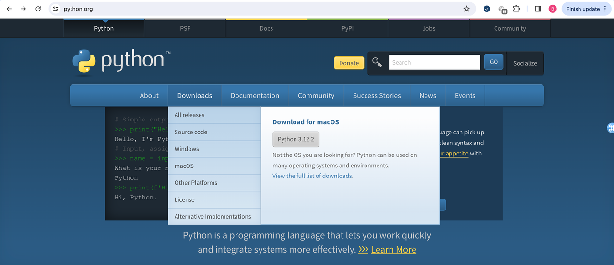

2. Click Download - Windows

    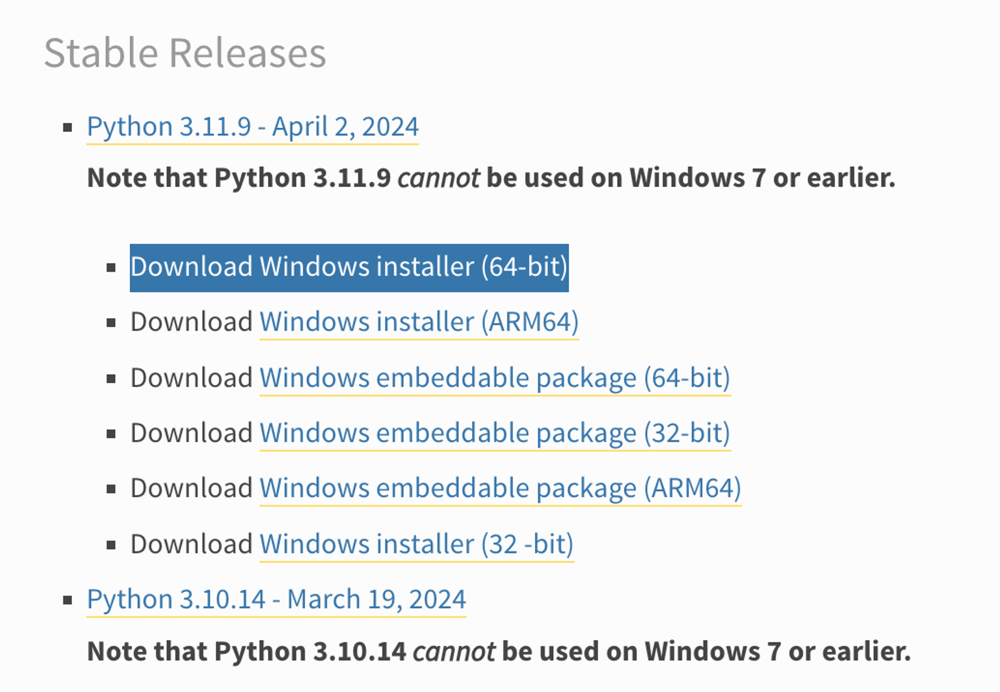

3. Choose Python 3.11.9

4. After you download the Windows installer, double-click its icon, and then follow the instructions to install Python in the default location, as follows:
    1. Select Install for All Users, and then click Next.
    2. Leave the default directory unchanged, but note the name of the installation directory
    3. (probably C:\Python31 or C:\Python32)
    4. Click Next.
    5. Ignore the Customize Python section of the installation, and
       click Next.

5. At the end of this process, you should have a Python 3 entry in
   your Start menu

    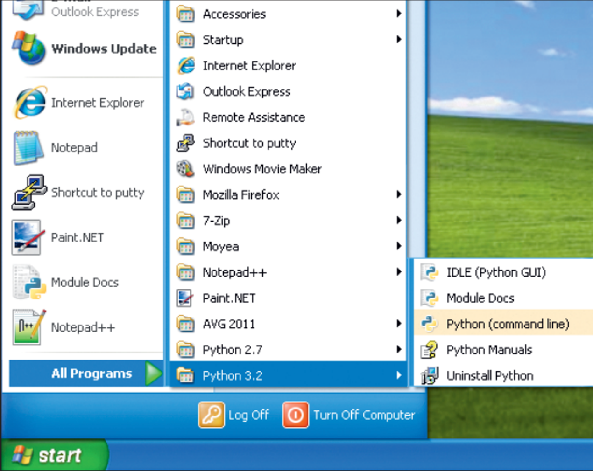

# Shell vs Code editor

    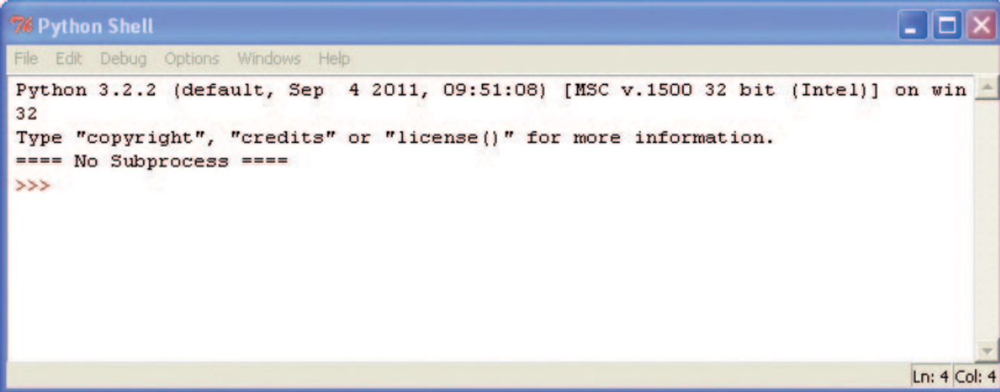

- This is the Python shell
- The three greater-than signs (>>>) are called the prompt
- Runs the code **line by line**
- You cannot save the code

    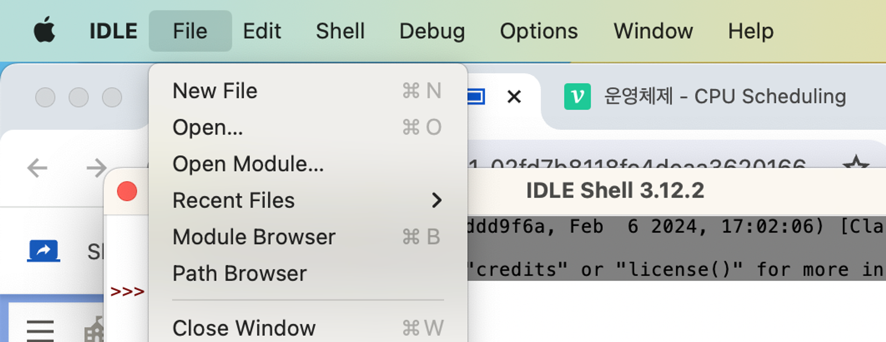

    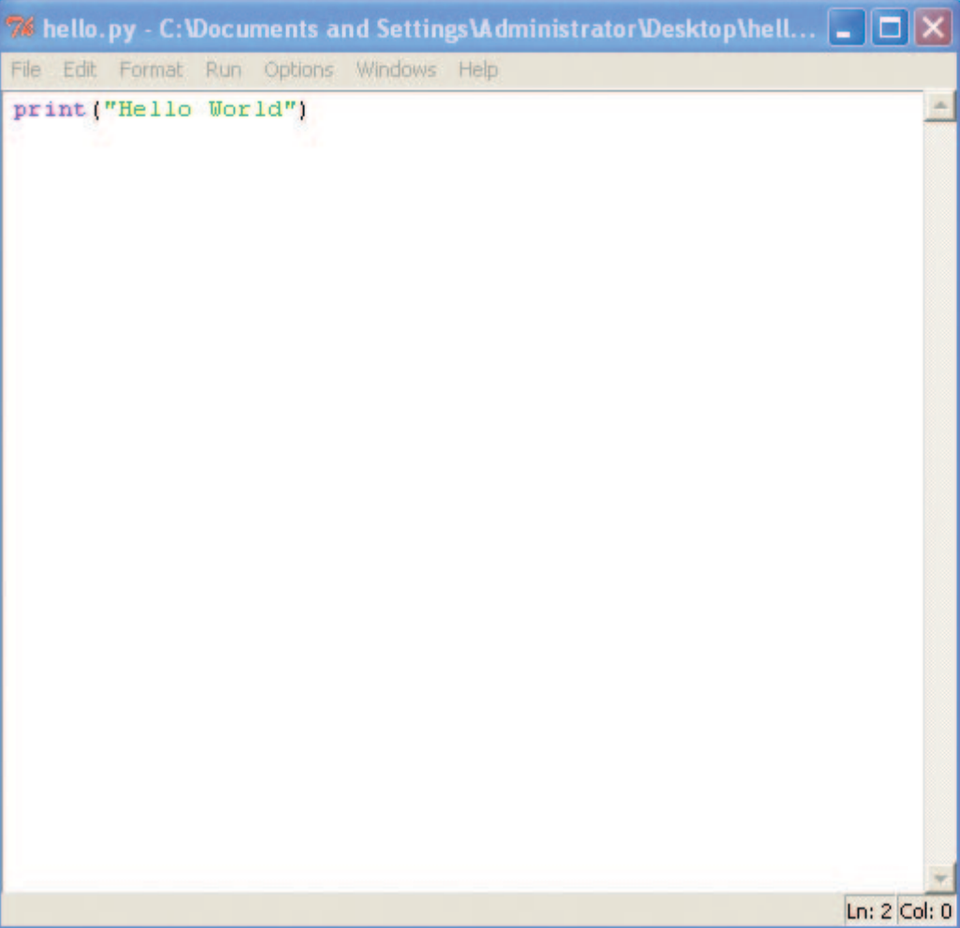

- This is the code editor
- Run **all** the codes
- You can save the code now!
- Ctrl+S to save
- F5 (fn + f5) to run to your code

# Strings

- A string is a collection of letters
- All the letters, numbers, and symbols could be a string.
- Use double or single quotations!

    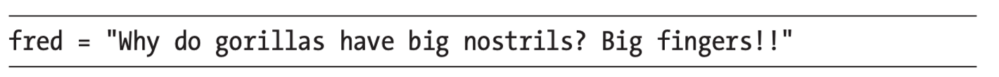

    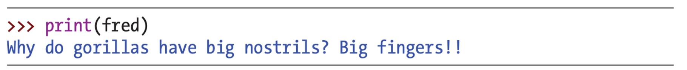

- to see what’s inside fred, we could enter print(fred)

    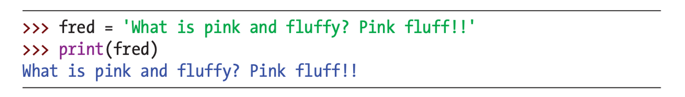

- You can also use single quotes to create a string

# Quiz 1

    

Will this prompt work?

    
Answer

No! it generates **SyntaxError**

    

- Syntax means the arrangement and order of words in a sentence
- SyntaxError means that you did something in an order Python was not expecting
- In this case, Python did not find **a double quote** to close the string.

# Multiline String

- Use three single quotes (''')

    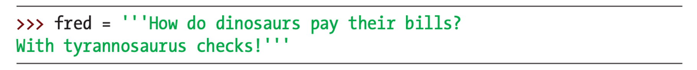

    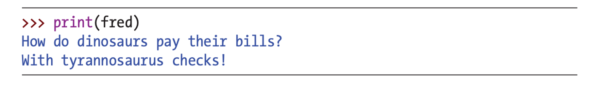

# Quotations Inside Quotations

- You cannot **just** use quotations in quotations

    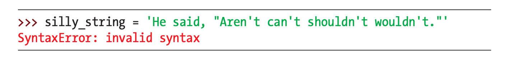

- How to **distinguish** the inside quotations?

# Challenge 1

First declare the **silly_string** above

Use **\** to distinguish the inside quotations

    
Answer

    

        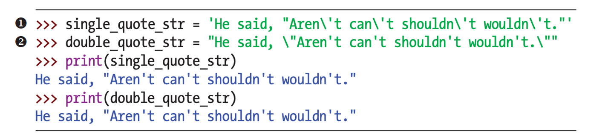
    

    

# Embedding Values in Strings

- replace **placeholder** %s with a variable

    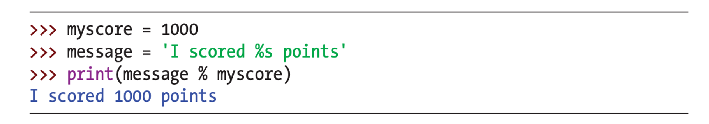

# Quiz 2

    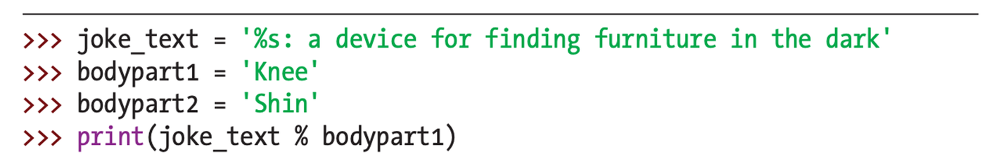

What is the output?

You can try in Python Shell

    
Answer

    Knee: a device for finding furniture in the dark
    
    This is same as print('%s: a device for finding furniture in the dark’  % 'Knee’)
    

