# List

## Creat

    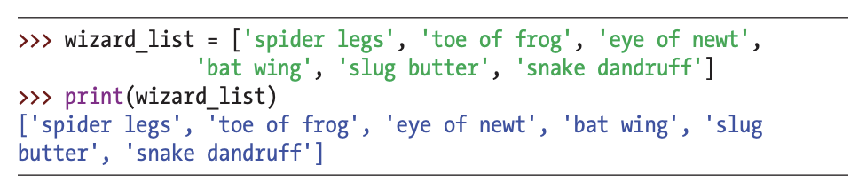

- Create a list using [ ] to store data

## Pick

    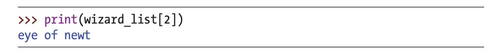

- A list is useful because it can be manipulated
- Use index position inside [] to pick a data from the list

    
What did you notice?

    Yes, a list starts at index position 0, so the first item in a list is 0, the second is 1, and the third is 2.

## Change

    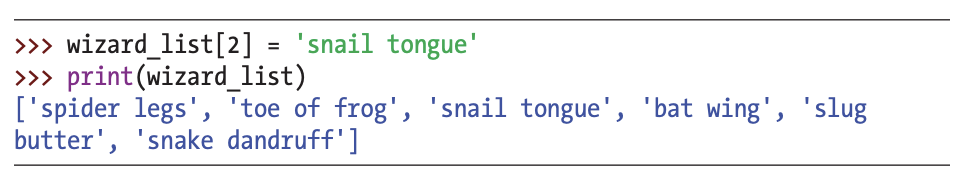

- You can also change an item in a list using []

## Subset

    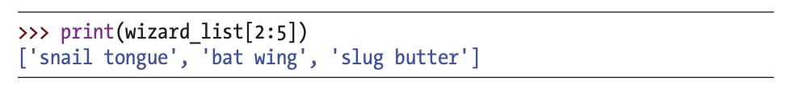

- use a colon (:) inside [] to show a subset of items in the list
- “show the items from index position 2 up to (but not including) index position 5”

## Type
- A list can store all sorts of items

    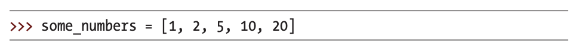

    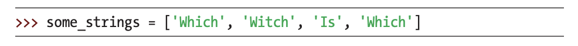

    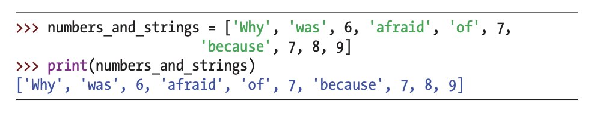

- A list can have mixture of number and strings

    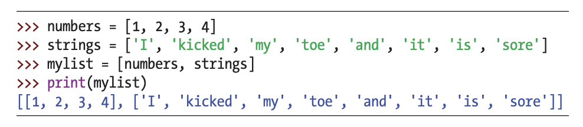

- A list can store other lists

## Add items

    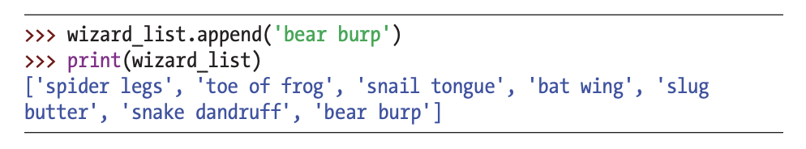

- Use the append function to add items to the end of a list
- A function is a chunk of code that tells Python to do something

    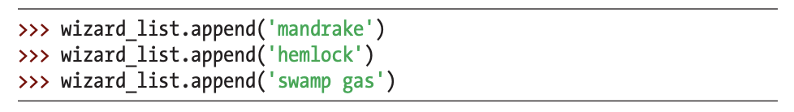

- Keep adding like this

## Quiz 1

fruits_list =  ['apple','banana']

(blank 1)

(blank 2)

print(fruits_list)

result: ['apple','banana', 'grape', 'grape']

**Fill in the blanks to get the result**

    
Answer

fruits_list.append('grape')

fruits_list.append('grape')

## Remove items

- Use the del command to remove items from a list

    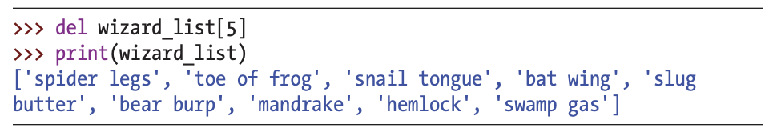

- Remember that positions start at zero
- wizard_list[5] refers to the sixth item in the list

## Quiz 2

fruits_list =  ['apple','banana', 'grape', 'grape']

(blank 1)

(blank 2)

print(fruits_list)

result: ['apple','banana']

**Fill in the blanks to get the result**

    
Answer

del fruits_list[3]

del fruits_list[2]

## List Arithmetic

- join lists just + sign

    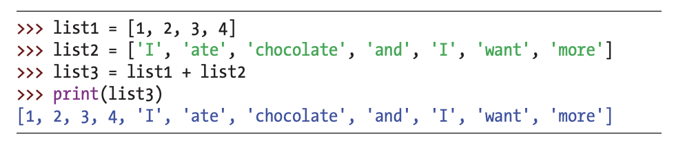

- join list1 and list2 by using + sign

- You can multiply a list by a number to repeat the list

    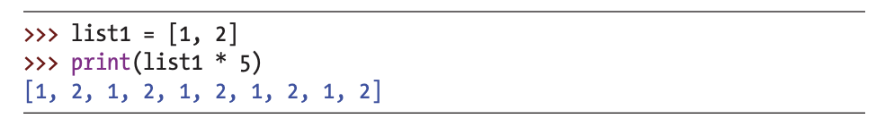

- This is telling Python to repeat list1 five times

## Challenge

tutor_information =  ['-','Beomsu','Seoul',24,'-']

You will create tutee_information list with your information

1. Get rid of all '-' using **a colon** in tutor_information
2. **Clone** tutor_information to tutee_information
3. **Replace** name, region, age with your information
4. **Combine** tutor_information and tutee_information to all_information list

