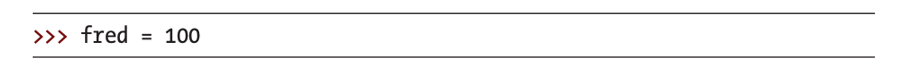
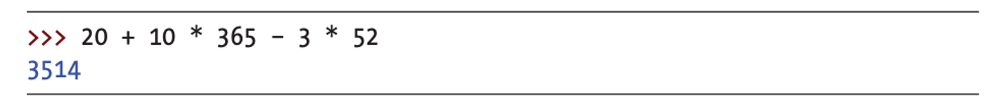

    

# No cramming a programming language

We are going to learn a programming language through challenges and projects.

> 💡 Let’s become a problem solver

What is **a small inconvenience** that happens daily in your life, that annoys you to no end, but there is nothing you can do about it?

> 💡 Let’s learn how to turn your thoughts into code

**But basics first!**

    

# Why python?

- Easy to learn ≠ Low level

- Simple and short code → **Easy to read!**

> 💡 Python helps you code fastly!

    

# Java vs Python

- Both codes print **“Hello World”** on the screen

- Python code is much simpler and shorter

> 💡 But it does not mean Java is a **bad** programming language!

# Build a recording habit

**[IMPORTANT!!]** Record your mistakes to avoid the same mistakes in the future

## Weekly I Learned (WIL)

- What did I learn this week?

- What were the challenges you faced in coding homework?

- How did I solve the challenges?

- Are there any better solutions? **I am here to help you** 😎

    

# Record your coding experience!

Github is a code storage where you can **save** and **present** your codes to other developers.

You can comment **opinions** and **contribute** to developer communities.

You will save **WIL, homeworks, projects** in GitHub to display your progress to the world!

Below is my github page

    

---

# No Installation for Today

Use online python compiler to test your code!

https://www.online-python.com/

Textbook pdf

https://bedford-computing.co.uk/learning/wp-content/uploads/2015/10/Python-for-Kids.pdf

Today we will be covering Chapter 1 and 2

# Calculating with Python

    

- Multiplication and division always go before addition and subtraction

## Basic Calculations

    

## The Order of Operations

- use parentheses to control the order of operations
- parentheses can be **nested** == ****parentheses can be inside parentheses

    

- multiply 30 by 20 and add the result by 5

    

- add 5 to 30, and then multiply the result by 20

## Prepare for a challenge

    

Now is a code editor mode. The code editor mode is used to execute **multiple lines of codes** at the same time. Let’s switch to shell mode to execute **line by line** clicking this button on the left side.

    

## Challenge 1

Use parentheses in between 5 + 30 * 20 / 10 to get **70.0**

Use print()

  
hint

  Did you use nested parentheses?

  
answer

  ((5+30)*20)/10

  Add 5 to 30, then multiply the result by 20, and divide that result by 10

  Python evaluates the **innermost** parentheses first, then the **outer** ones, and then the final division operator.

# Variables Are Like Labels

- a place to store information such as numbers, text, lists of numbers and text, and so on.
- use an equal sign (=) and then tell Python what information the variable should
  be the label for

    

    

- Assign 100 to fred and print fred

    

- Assign 200 to fred, assign fred to john, and print john
- 200 = fred = john
- We can use more than one label for the same item!

# Variable naming convention

## **Required**

- made up of letters, numbers, and the underscore character (_), but they can’t start with a number.
- capital letters possible
- can’t contain a space, so use an underscore to separate words

## Recommended

- a short variable name is best
- a variable name should be meaningful

## Quiz 1

Which variable name is invalid?

a) found_coins

b) 2ships

c) Stolen_coins

D) foundCoins

  
answer

  **b) can’t start with a number!**

  What is a difference between a) and d)?

  

    
  

  

## Challenge 2

    

Use variables to express the equation above.

**Conditions**: found_coins is 20, magic_coins is 10, and stolen_coins is 3

  
answer

  found_coins = 20

  magic_coins = 10

  stolen_coins = 3

  found_coins + magic_coins * 365 - stolen_coins * 52

# Chapter 3 will cover..

- Data containers like lists, tuples, maps, and string
- You will be able to store data!
